<!-- hero: monochrome ASCII portrait beside a neofetch-style info card.
     regenerate with: python scripts/make_ascii_svg.py && python scripts/make_info_card.py -->

<!-- animated contribution graph: refreshed from public GitHub contribution data by the workflow -->

<h3><code>puneeth@github:~$ ./contributions.sh</code></h3>

 
 

<h3><code>puneeth@github:~$ whoami</code></h3>

<table>
<tr>
<td valign="top"></td>
<td valign="top"></td>
</tr>
</table>

 
 

<h3><code>puneeth@github:~$ ./links.sh</code></h3>

<b>Associate Software Engineer · Cargill</b>

 

